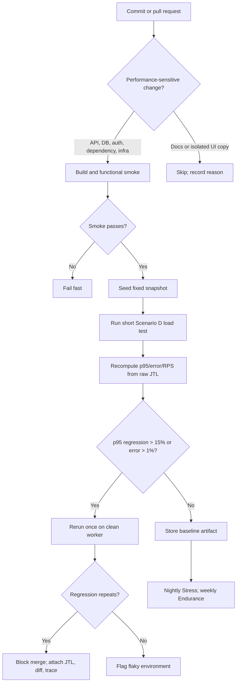

# HW05 - AI-Assisted Performance Testing

## 1. Student and submission information

| Field | Value |
| --- | --- |
| Student | NGUYEN THIEN NHA TRAN |
| Student ID | 23127272 |
| Class | 23KTPM2 |
| Assignment | HW05-AI |
| Date | 2026-08-17 |
| Tool | Apache JMeter 5.6.3 |
| SUT | EShop REST backend, Node.js + Express + SQLite |
| Selected workflow | Scenario D - Admin order fulfillment |

This report separates measured facts from student-captured evidence. Raw logs and machine traces in `performance/results/` were produced by real local executions. The screenshots, GitHub issue, and three student-narrated scenario videos are linked below.

## 2. Scenario selection and source review

Scenario D was selected because it differs from the common customer checkout flow and still covers the three required endpoint groups.

| Step | Endpoint | Group | Correlation / assertion |
| --- | --- | --- | --- |
| 1 | `POST /api/login` | Auth-heavy | Extract JWT; assert token and `user.role == admin` |
| 2 | `GET /api/users/me` | Auth-heavy | Assert email and admin role |
| 3 | `GET /api/admin/orders` | Read-heavy | Assert CSV order exists with `current_status` |
| 4 | `GET /api/products` | Read-heavy | Assert non-empty JSON array |
| 5 | `GET /api/categories` | Read-heavy | Assert non-empty JSON array |
| 6 | `PUT /api/admin/orders/{id}/status` | Transactional | Assert business-success message |
| 7 | `GET /api/admin/orders` | Read-heavy verification | Assert the same order now has `next_status` |

Source review found four facts that shaped the plan:

1. The database is dropped and rebuilt whenever `server.js` starts. Restart is therefore the reset procedure.
2. Admin routes authenticate a JWT but do not enforce the admin role. The test adds an explicit role pre-check and records BUG-ADMIN-001.
3. Order transitions are stateful. Every iteration must receive a unique order ID; CSV recycling is disabled.
4. `GET /api/admin/orders` has no pagination and returns every order. With 6,000 seeded rows, the baseline response is about 1.07 MB, making it a meaningful read-heavy operation.

## 3. Data design and reset contract

`performance/data/admin-orders.csv` has these columns:

```text
admin_email,admin_password,order_id,current_status,next_status
```

The seed tool creates 6,000 unique pending orders for Load/Stress/Spike and 7,500 for Endurance. Every measured run follows the same sequence:

1. Verify the process on port 3000 is the EShop `node server.js` process.
2. Restart it, which resets SQLite, lockout counters, and in-memory state.
3. Seed orders through the public checkout API; setup traffic is excluded from JTL.
4. Run preflight: unique IDs, all states pending, valid admin login, explicit role check.
5. Run JMeter headlessly while sampling the backend PID every second.

CSV uses `shareMode.all`, `recycle=false`, and `stopThread=true`. This prevents two virtual users from updating the same mutable order. Valid credentials avoid contaminating the workflow with the account-lockout path.

## 4. Baseline and workload model

The baseline used one virtual user, five sequential workflows, and no think time. Whole-workflow mean was **193.53 ms**, p95 **246.33 ms**. The two order-list calls dominated: 79.52/77.98 ms mean and approximately 1.07 MB per response. Status update mean was 8.17 ms, p95 11.78 ms.

| Plan | Workload | Duration | Intent | Listener/report view |
| --- | --- | --- | --- | --- |
| Load | 20 VU, ramp 30 s | 180 s | Expected admin traffic | Aggregate Report |
| Stress | 25 VU; +25 at 90 s; +50 at 180 s | 300 s | Find saturation and degradation | Summary Report |
| Spike | 15 VU baseline; +120 VU at 90 s for 60 s | 240 s | Sudden surge plus 90 s recovery | View Results Tree |
| Endurance | 25 VU, ramp 30 s | 900 s | Validate sustained threshold and memory trend | Response Time Graph |

Think time is non-uniform: 200-500 ms after login, 500-1,200 ms before reading the large order list, 250-600 ms around product/category reads, 600-1,200 ms before the state change, and 300-700 ms before verification. Load ramp-up avoids an accidental spike. Stress adds cohorts. Spike starts its added cohort within one second.

Human-reviewed acceptance criteria:

- Assertion error rate below 1% for a valid Load run.
- Login p95 below the SUT's 700 ms authentication target.
- Product-list p95 below the SUT's 800 ms product-list target.
- Stress is exploratory: saturation is a finding, not an automatic failure.
- Spike recovery passes only if the post-spike baseline returns close to the pre-spike latency/rate with no continuing error burst.
- Endurance threshold requires less than 1% errors, no upward p95 drift, and a bounded memory trend.

## 5. Test-plan review and fixes

| AI draft risk | Why it was wrong/incomplete | Final correction |
| --- | --- | --- |
| Reuse one order across VUs | State transitions are irreversible and concurrent updates race | Unique CSV order per iteration; no recycle; preflight |
| Trust 200 status | Empty/wrong JSON or a stale state could pass | Seven content-aware Groovy assertions and JWT correlation |
| Treat any JWT as admin | Backend omits role authorization | `/api/users/me` role assertion; separate security bug |
| Use one uniform timer | Admin reading/decision steps have different human delays | Six step-specific uniform-random timers |
| Run GUI under load | GUI listeners consume load-generator resources | CLI run; listeners retained only as the three required report-view types |
| Accept the first Spike run | The machine slept, so the cohort started after baseline | Recorded the rejection reason, added process-scoped anti-sleep, reran, and excluded the invalid folder from the final package |

The three deliverable plans pass the local structural validator: bounded duration, CSV input, think time, assertions, extractor/correlation, distinct listeners, and exact filename convention.

## 6. Execution evidence and results

All valid runs used host `TRAN`, JMeter and SUT on the same machine. Resource figures measure the backend PID, not JMeter.

| Metric | Load | Stress | Spike |
| --- | ---: | ---: | ---: |
| Valid span | 179.98 s | 299.92 s | 239.50 s |
| Samples | 5,533 | 25,530 | 10,727 |
| Assertion errors | 0 | 0 | 0 |
| Error rate | 0.000% | 0.000% | 0.000% |
| Overall mean | 91.79 ms | 199.69 ms | 495.64 ms |
| Overall p95 | 264 ms | 622 ms | 1,915 ms |
| Average throughput | 30.74 req/s | 85.12 req/s | 44.79 req/s |
| Peak 1-second bucket | 42 req/s | 175 req/s | 220 req/s |
| Peak threads | 20 | 100 | 135 |
| Backend CPU peak | 5.22% | 6.20% | 5.59% |
| Backend memory ceiling | 167.9 MiB | 369.6 MiB | 449.1 MiB |

### 6.1 Load

Load passed its correctness criteria. Login p95 was 248 ms and product-list p95 198 ms, both below their SUT targets. The transactional status update was the slowest p95 at 320 ms. No saturation was detected. The 42 req/s peak is not reported as capacity; the best 30-second window under the analysis rule was 33.87 req/s with worst p95 300 ms.

### 6.2 Stress

The step windows show the cost of concurrency:

| Window | Mean rate | Mean bucket p95 | Worst bucket p95 | Errors |
| --- | ---: | ---: | ---: | ---: |
| 25 VU steady | 37.98 req/s | 338.95 ms | 772 ms | 0% |
| 50 VU steady | 94.00 req/s | 95.33 ms | 743 ms | 0% |
| 100 VU | 126.52 req/s | 554.01 ms | 1,252 ms | 0% |

The analyzer detected saturation after second 197: additional threads no longer consistently increased throughput and added latency. The update endpoint had p95 875 ms, higher than every other label. CPU remained low, so the data does not support a CPU-bottleneck claim. Likely causes must be verified with further profiling; SQLite serialization, JSON construction, transfer of the unpaginated order list, and local generator contention are candidates, not proven facts.

### 6.3 Spike and recovery

| Phase | Mean rate | Mean bucket p95 | Worst bucket p95 | Mean active threads |
| --- | ---: | ---: | ---: | ---: |
| Pre-spike steady (30-89 s) | 30.15 req/s | 63.90 ms | 121 ms | 16.0 |
| Spike (90-149 s) | 96.55 req/s | 1,512.18 ms | 2,923 ms | 134.4 |
| Recovery (180-229 s) | 28.16 req/s | 83.32 ms | 194 ms | 15.0 |

The service survived without assertion failures and recovered. Recovery mean rate was 6.6% below pre-spike and mean bucket p95 was 30.4% higher, but the final 20 buckets had p95 values from 57 to 137 ms and all returned to 15 VU. The run demonstrates recovery, with a modest residual latency penalty rather than immediate perfect equivalence.

### 6.4 Endurance threshold

The 25-VU Endurance run produced **42,094 samples over 899.75 seconds with 0 errors**. After excluding the 30-second ramp-up, it sustained an average **47.55 req/s** with p95 **97 ms**. The best qualifying 30-second window held 50.23 req/s; the 62 req/s one-second peak is not capacity. Therefore, the highest soak-validated stable threshold on this hardware and dataset is **47.55 req/s at 25 VU**, not the higher short Stress burst.

Backend CPU peaked at 5.72%. Memory ceiling was 286.7 MiB. Minute means rose during warm-up (102.4, 152.5, 207.1, then 231.0 MiB) and then stayed roughly 233-240 MiB from minutes 3-14. The first/last tenth means were 119.7/232.9 MiB, but the minute series shows a plateau rather than continuing growth. Response p95 improved from 111.97 ms in the first tenth to 37.91 ms in the last tenth, with no error drift. This run does not show a memory leak.

### 6.5 Invalid run excluded

The first Spike attempt was invalid because the machine slept before the intended 120-thread cohort completed. It was excluded from every result table and removed from the final evidence package so only the four accepted runs remain.

## 7. AI analysis and misinterpretation hunt

The preserved first-pass AI output is `AI docs/AI-initial-analysis.md`.

| AI claim | Verdict | Correct value from raw evidence | Human correction |
| --- | --- | --- | --- |
| Stress capacity is 175 req/s | Invalid | 175 is one 1-second peak; overall 85.12 req/s; best qualifying 30-second window 136.17 req/s | A momentary peak is not sustained capacity. Use the soak threshold for the final capacity claim. |
| Spike did not recover because overall p95 is 1,915 ms | Invalid | Recovery window mean bucket p95 83.32 ms; final 20 buckets 57-137 ms | Overall p95 mixes baseline, spike, and recovery and cannot answer recovery. |
| Load proves a memory leak | Invalid | First/last tenth 66.4/151.1 MiB, but Load includes ramp-up from 1 to 20 VU | A short ramped run cannot prove a leak. Use the 15-minute resource trend. |
| Every Stress endpoint has p95 622 ms | Invalid | Per-label p95 ranges from 496 ms (`users/me`) to 875 ms (status update) | Overall percentile is a weighted distribution, not each label's percentile. |
| CPU is the bottleneck | Unsupported | Backend CPU peak 6.20% on a 20-logical-processor host | Latency degradation with low process CPU needs DB/event-loop/I/O profiling; no bottleneck is proven. |

### Optimization review

| Proposal | Classification | Evidence-based judgment |
| --- | --- | --- |
| Paginate admin order list | Feasible | Source uses an unbounded `SELECT ... ORDER BY`; baseline responses are ~1.07 MB and the two list calls dominate read cost. |
| Add index on `orders.status` | Unfounded for this flow | The measured list does not filter by status; the update locates `id`, already the primary key. |
| Increase DB connection pool | Hallucinated | The backend uses one `sqlite3.Database`; no configurable pool exists in this architecture. |
| Enable SQLite WAL | Feasible experiment, not proven fix | WAL may reduce read/write interference, but these logs do not isolate SQLite locking. Benchmark before/after. |
| Add admin-role middleware | Feasible security fix | Required by FR-12 and source-confirmed, but it does not explain measured latency. |

## 8. AI Critique (200-300 words)

The AI was useful for turning Scenario D into repeatable JMeter plans, but its first analysis was too willing to convert visible summary numbers into conclusions. It called the Stress peak of 175 requests per second “capacity,” although the raw JTL shows that this was only one one-second bucket; average throughput was 85.12 requests per second, and sustained behavior must be checked over a longer window. It also used the Spike run’s overall p95 of 1,915 ms to claim that recovery failed. That statistic mixes three different phases. The recovery-only buckets instead averaged 83.32 ms at p95 and returned to 15 active threads. A third mistake was treating Load memory growth as a leak. The first tenth occurred during ramp-up, so comparing it directly with the fully loaded final tenth confounds concurrency with leakage. The AI also proposed a connection-pool change that does not exist in this SQLite architecture and an index on `status` that the measured query would not use.

These errors happened because a generic summary hides time windows, endpoint labels, source architecture, and test-side events. The machine-sleep incident made this especially clear: JMeter exited successfully and generated a dashboard, yet the raw timestamps and `allThreads` proved that the first Spike attempt was invalid. My main lesson is that AI should generate falsifiable claims, not final verdicts. I must recompute percentiles from the raw JTL, align them with resource timestamps, inspect each endpoint separately, verify suggestions against source code, and document why excluded runs were rejected. AI accelerates the work; the human remains responsible for the evidence contract and interpretation.

## 9. Continuous performance testing proposal



The gate should compare the same endpoint label, data snapshot, worker class, and steady-state window. A 15% p95 regression threshold is large enough to reduce noise on shared CI but still catch meaningful degradation; it must be calibrated from repeated runs. A second clean-worker run lowers false alarms but doubles cost on suspected regressions. PRs run only a short Load test; Stress runs nightly and Endurance weekly to control compute time. Raw JTL, environment metadata, and resource traces are retained so a regression can be reproduced. Risks remain: shared runners create noise, fixed seed data may not represent production growth, and broad path filters may skip an indirect performance change. Conservative triggers cost more but reduce false negatives.

## 10. Required student-captured evidence

- [x] Four same-frame screenshots: `performance/evidence/load-peak.png`, `stress-peak.png`, `spike-peak.png`, and `endurance-peak.png`.
- [x] `performance/evidence/hardware-dxdiag.png` visibly shows hostname `TRAN`.
- [x] At least six minutes total of Vietnamese narration, split by scenario as permitted by the assignment: [Load](https://youtu.be/V9yUT83EWaQ), [Stress](https://youtu.be/Kezjr_zH-vo), and [Spike](https://youtu.be/NZoZCMwne4I).
- [x] BUG-ADMIN-001 published with request/response evidence: <https://github.com/ntntran09/eshop-sut/issues/56>.
- [x] Review all AI artifacts and set final audit verdicts/signature.
- [x] Confirm Scenario D is not duplicated by another group member.

## 11. References

1. HW05 assignment, version 2.0.
2. Course lecture `S11.2_Performance Testing.pdf`.
3. EShop repository and backend source: <https://github.com/ttbhanh/eshop-sut>.
4. Apache JMeter 5.6.3 documentation: CLI mode, CSV Data Set Config, assertions, listeners, and dashboard generation.
