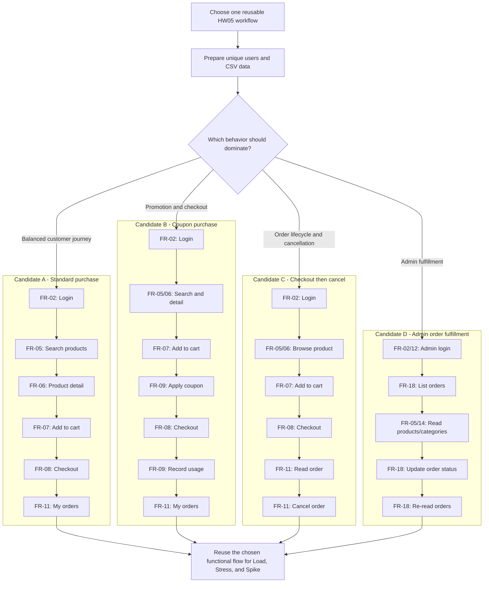

# HW05 Performance Test Scenario Candidates

## 1. Status and decision to make

- Selected scenario: **D - Admin order fulfillment**
- Target tool: **Apache JMeter 5.6.3**
- Student ID: **23127272**
- Duplicate check with other group members: **Confirmed unique on 18/08/2026**

This document is a selection aid, not an execution record. Workload values, thresholds, and expected performance results must be established from a real baseline run; they are intentionally not invented here.

## 2. Non-negotiable HW05 constraints

The selected scenario must:

1. Be one end-to-end workflow reused for Load, Stress, and Spike tests.
2. Cover all three endpoint groups:
   - **Auth-heavy**
   - **Read-heavy**
   - **Transactional**
3. Use CSV input data for credentials, product IDs, coupon data, or order payloads.
4. Use valid test accounts during measured traffic. A failed-login path can trigger account lockout and should not be mixed into the normal workload.
5. Use three distinct report/listener output types across Load, Stress, and Spike.
6. Name each test plan `{StudentID}_{ScenarioType}_{YYYYMMDD}`.
7. Produce real execution evidence. No `.jtl`, metrics, screenshots, hardware evidence, or endurance threshold is assumed in this document.
8. Be different from the workflow selected by other members of the group.

## 3. Feature-to-endpoint map

The following mappings combine the feature pools in the assignment with endpoints verified in the current EShop API documentation and backend source.

| Endpoint group | Relevant features | Candidate endpoints | Role in a scenario |
| --- | --- | --- | --- |
| Auth-heavy | FR-02 Login and account lockout | `POST /api/login` | Authenticate each virtual user and obtain a JWT. |
| Auth-heavy supplement | FR-04 Profile management | `GET /api/users/me` | Confirm the token and read account context. |
| Read-heavy | FR-05 Product listing and search | `GET /api/products`, `GET /api/products?search={keyword}` | Browse or search the catalogue. |
| Read-heavy | FR-06 Product detail | `GET /api/products/{id}` | Read the selected product and obtain its current price. |
| Transactional | FR-07 Shopping cart | `GET /api/cart`, `POST /api/cart` | Create user-specific cart state through the backend API. |
| Transactional | FR-08 Checkout | `POST /api/checkout` | Create an order. |
| Transactional supplement | FR-09 Discount coupons | `POST /api/apply-coupon`, `POST /api/coupon-usage` | Calculate a discount and persist per-user coupon usage. |
| Transactional supplement | FR-10 Order state machine | `PUT /api/admin/orders/{id}/status` | Advance an order through a valid state transition. |
| Transactional supplement | FR-11 Order history | `GET /api/orders/my-orders`, `GET /api/orders/{id}`, `PUT /api/orders/{id}/cancel` | Verify or cancel the newly created order. |

Registration (`POST /api/register`) should normally be test setup, not part of measured iterations, because repeated registration changes database size and can hide the performance of the chosen business flow.

## 4. Scenario selection map



Every candidate includes authentication, reads, and a transaction. Only one branch should be selected for the three measured scenarios.

## 5. Candidate comparison

These ratings are preliminary AI assessments for selection; the tester must validate them against available accounts, seed data, group uniqueness, and the running SUT.

| Candidate | Coverage | Setup effort | State/data growth | Main strength | Main risk | Preliminary fit |
| --- | --- | --- | --- | --- | --- | --- |
| **A - Standard purchase** | FR-02, FR-05, FR-06, FR-07, FR-08, FR-11 | Medium | One cart entry and order per iteration | Balanced, realistic, and easy to explain | Orders grow continuously; backend checkout does not strongly couple the order to cart contents | **Recommended baseline choice** |
| **B - Coupon purchase** | Candidate A plus FR-09 | High | Orders and coupon-usage rows grow | Richest business workflow and more metric segments | Coupon limits, expiry, minimum amount, and known calculation behavior can cause state-dependent failures | Strong choice if coupon data is controlled |
| **C - Checkout then cancel** | Candidate A plus cancellation | Medium-high | Orders remain, but end as canceled | Exercises a complete order lifecycle and recovery-like operation | Each order can be canceled only once; requires reliable correlation of the new `orderId` | Good distinctive alternative |
| **D - Admin fulfillment** | FR-02/12, FR-05/14, FR-18 | High | Existing orders change state irreversibly | Less likely to duplicate a customer checkout flow | Needs pre-created orders, admin credentials, valid state transitions, and careful isolation | Select only with controlled seed/reset |

## 6. Candidate details

### Candidate A - Standard purchase

Suggested measured sequence:

1. `POST /api/login`
2. `GET /api/products?search={keyword}`
3. `GET /api/products/{product_id}`
4. `POST /api/cart`
5. `GET /api/cart`
6. `POST /api/checkout`
7. `GET /api/orders/my-orders`

Suggested CSV fields:

```text
email,password,search_keyword,product_id,quantity,shipping_address
```

Use this when the priority is a defensible, balanced workflow with moderate setup complexity.

### Candidate B - Coupon purchase

Suggested measured sequence:

1. Perform Candidate A through `GET /api/cart`.
2. `POST /api/apply-coupon` with `user_id`.
3. `POST /api/checkout` using the returned final amount.
4. `POST /api/coupon-usage` only after successful checkout.
5. `GET /api/orders/my-orders`.

Suggested CSV fields:

```text
email,password,search_keyword,product_id,quantity,coupon_code,shipping_address
```

Use this only when each virtual user has a valid coupon allowance or when coupon usage can be reset between runs.

### Candidate C - Checkout then cancel

Suggested measured sequence:

1. Perform Candidate A through `POST /api/checkout`.
2. Extract `orderId` from the checkout response.
3. `GET /api/orders/{orderId}`.
4. `PUT /api/orders/{orderId}/cancel`.
5. `GET /api/orders/my-orders` and verify the resulting state.

Suggested CSV fields:

```text
email,password,search_keyword,product_id,quantity,shipping_address
```

Use this when order-state behavior is the differentiator and every iteration can create a fresh order.

### Candidate D - Admin order fulfillment

Suggested measured sequence:

1. `POST /api/login` with an admin account.
2. `GET /api/admin/orders`.
3. `GET /api/products` and `GET /api/categories`.
4. Select an eligible order from controlled input data.
5. `PUT /api/admin/orders/{order_id}/status` with one valid next state.
6. `GET /api/admin/orders` and verify the transition.

Suggested CSV fields:

```text
admin_email,admin_password,order_id,current_status,next_status
```

Use this only when a resettable order pool is available. Do not let concurrent virtual users update the same order.

## 7. Source-level risks to consider before choosing

1. **Login lockout:** the current backend changes failed-attempt state and locks accounts. Normal performance traffic should use verified valid credentials; test lockout separately and reset affected accounts between runs.
2. **Cart persistence:** backend carts are stored in process memory. Reusing the same account can continually enlarge its cart, so assign accounts deterministically and define cleanup/restart behavior.
3. **Order growth:** checkout inserts a database row on every success. Large Load/Stress/Spike runs require a database snapshot, cleanup plan, or isolated test database.
4. **Checkout coupling:** the current checkout endpoint accepts a total and creates an order without validating backend cart items. Calculate totals from the selected product, assert the response, and disclose this limitation when claiming an end-to-end flow.
5. **Coupon state:** applying a coupon and recording its usage are separate calls. Only record usage after a successful checkout, and avoid sharing a limited coupon/user pair across iterations.
6. **Order transitions:** admin status changes and user cancellation are stateful and cannot be safely repeated on the same order.
7. **Product selection:** confirm that every CSV `product_id` exists before the measured run. The product-detail endpoint can return an empty object for an unknown ID.
8. **Admin authorization:** the current backend routes use token authentication but do not consistently enforce an admin role. Candidate D therefore needs an explicit role pre-check and must not treat a successful token-only request as proof of correct access control.

## 8. Selection checklist

Before marking a scenario as selected, answer all items:

- [x] The workflow is not duplicated by another group member. (Confirmed by the student on 18/08/2026.)
- [x] All endpoint paths have been smoke-tested against the running backend.
- [x] Test users, products, coupons, and orders are isolated and resettable.
- [x] One virtual user cannot corrupt another user's mutable state.
- [x] Assertions distinguish HTTP success from business success.
- [x] CSV rows are sufficient for the intended concurrency.
- [x] The same functional sequence can run unchanged under Load, Stress, and Spike workload models.
- [x] Setup and cleanup traffic can be excluded from measured metrics.
- [x] Raw result and resource-monitor evidence can be attributed to one named run.
- [x] Load, Stress, and Spike use distinct report outputs and the required filename convention.

## 9. Tester decision

Complete this section after reviewing the candidates:

```text
Selected candidate: D - Admin order fulfillment
Reason for selection: It exercises an authenticated, state-changing admin workflow with controlled order transitions.
How it differs from other group members: The student confirmed that no other group member selected Scenario D.
Tool (JMeter or k6): Apache JMeter 5.6.3
Accounts/data available: Default admin plus a resettable, uniquely assigned order pool generated before each run.
Known risks accepted: Unpaginated admin order responses; missing role enforcement is recorded separately as a functional security defect.
Changes required before implementation: Add role pre-check, unique CSV assignment, transition assertions, database reset, and resource monitoring. Completed in the supplied harness.
```

Human Review:
- Status: Reviewed and accepted by Nhã Trân on 18/08/2026
- Accepted: Candidate D, endpoint mapping, data-reset strategy, and JMeter selection
- Modified: Added explicit role assertion, unique order allocation, transition assertions, and resource evidence
- Removed: Unsupported performance thresholds before measurement
- Added: Load/Stress/Spike/Endurance evidence, AI critique, and GitHub issue #56
- Notes: Scenario D uniqueness confirmed within the group
